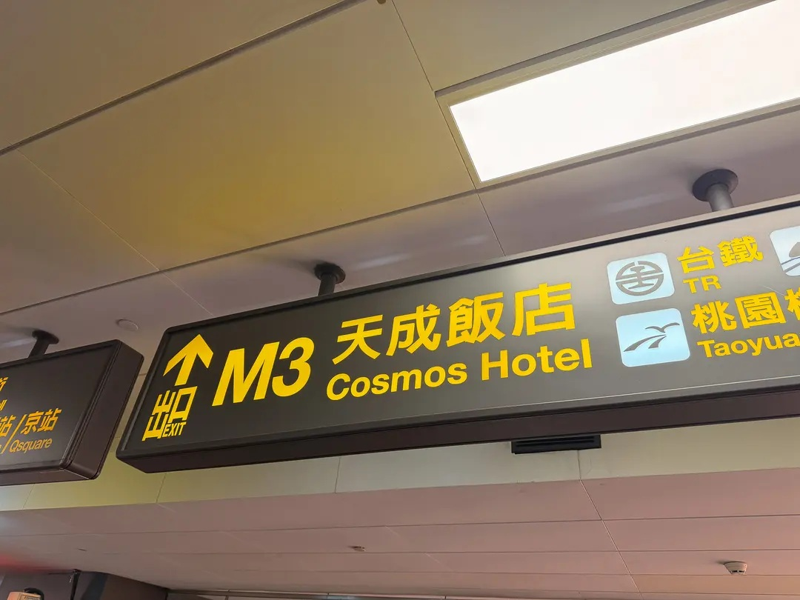
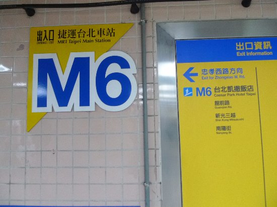

# Destination and sign-name inventory

**PHIT 2026 Finalist Team: 3rdEye4All**

**AI Eye 4 All: AI Indoor Navigation for Inclusive Smart Cities.**

Researched 2026-10-04.

Initial sign-name inventory for Taipei Main Station and connecting shopping areas. Nearby destinations are candidates until their names are readable in an exact source image. This is not an exhaustive inventory of every sign or business.

Independent expert review pending. English names may be normalized translations rather than printed text. Online existence does not establish appearance in a photograph, current routes, accessible paths or precise positioning. No names are propagated across filename families. Capture dates and current operational status remain unverified.

Visual scan of 380 existing CLS contact-sheet samples spanning 95 classes, the first COCO family sheet, and 24 enlarged exact CLS crops. Existing whole-photo records also consulted. Web searches followed by selected official and secondary page reads. No full-dataset OCR; expert review pending. On 2026-10-05, 19 additional full photographs were annotated, adding two readable storefront names and full-photo K Underground Mall evidence. Three separate user-supplied photographs are supplemental browser-demo examples and are excluded from the TibaMe POC counts. No repeat online research was needed.

## Hotels and shopping

| Name | Photo evidence | Online check |
| --- | --- | --- |
| Cosmos Hotel Taipei / 台北天成大飯店 | Readable in supplemental demo photo / 補充示範照片可讀 | Secondary page + official search listing; official page blocked |
| Caesar Park Hotel Taipei / 台北凱撒大飯店 | Readable in supplemental demo photo / 補充示範照片可讀 | Official page read |
| Palais de Chine / 君品酒店 | Photo match pending / 待照片對照 | Official page read |
| Taipei City Mall / 台北地下街 | Readable in sampled image / 樣本可讀 | Secondary page read; official check incomplete |
| Zhongshan Metro Mall / 中山地下街 | Readable in sampled image / 樣本可讀 | Official page read |
| Station Front Metro Mall / 站前地下街 | Readable in sampled image / 樣本可讀 | Official page read |
| K Underground Mall / K區地下街 | Readable in sampled image / 樣本可讀 | Online identity unresolved |
| Q square / 京站時尚廣場 | Photo match pending / 待照片對照 | Official page read |
| Shin Kong Mitsukoshi — Taipei Main Station / 新光三越 臺北車站 | Photo match pending / 待照片對照 | Official page read |
| Shin Kong Mitsukoshi — Taipei Station Front / 新光三越 台北站前店 | Photo match pending / 待照片對照 | Official page read |
| TRA Bento Shop / 臺鐵便當本舖 | Readable in sampled image / 樣本可讀 | Not checked online; photo evidence recorded |

## Entry notes and evidence

### Cosmos Hotel Taipei / 台北天成大飯店

The supplemental M3 photograph supplied for the browser demo reads 天成旅店 / Cosmos Hotel. It is outside the TibaMe POC dataset. This sign evidence does not verify a route or hotel entrance.

Aliases: 臺北天成大飯店, 天成飯店, 天成旅店, Cosmos Hotel.

-  — user-supplied demo photograph, outside the TibaMe POC dataset.
- [Cosmos Hotel Taipei official website](https://www.cosmos-hotel.com.tw/) — Official listing found by exact-name Bing search; direct page returned HTTP 403. Listing names the hotel and M3; no route instruction inferred.
- [Cosmos Hotel Taipei — Wikipedia](https://en.wikipedia.org/wiki/Cosmos_Hotel_Taipei) — Page read; secondary corroboration of English/Chinese hotel identity. Linked Taiwanstay registry timed out.

### Caesar Park Hotel Taipei / 台北凱撒大飯店

The supplemental M6 photograph supplied for the browser demo visibly lists 台北凱撒飯店 / Caesar Park Hotel Taipei. It is outside the TibaMe POC dataset. The hotel listing's arrow association and route are not established by this image.

Aliases: 臺北凱撒大飯店, 台北凱撒飯店, 凱撒飯店, Caesar Park.

-  — user-supplied demo photograph, outside the TibaMe POC dataset.
- [Caesar Park Hotel Taipei official website](https://taipei.caesarpark.com.tw/) — Official page read; hotel identity and relationship to Taipei Main Station confirmed.

### Palais de Chine / 君品酒店

Station-area hotel confirmed online; a readable sign in this dataset is still needed.

Aliases: Palais de Chine Hotel.

- [Palais de Chine official website](https://www.palaisdechinehotel.com/) — Official page read; hotel identity and station-area location confirmed.

### Taipei City Mall / 台北地下街

Chinese/English destination readable in existing whole-photo records. Y-area wording is an online search alias; do not substitute it for the original sign transcription.

Aliases: 臺北地下街, Y區地下街.

- [tps-scene-006](../release/huggingface/scene_images/scene_006.png) — existing masked photograph.
- [tps-scene-011](../release/huggingface/scene_images/scene_011.png) — existing masked photograph.
- [tps-scene-012](../release/huggingface/scene_images/scene_012.png) — existing masked photograph.
- [tps-scene-013](../release/huggingface/scene_images/scene_013.png) — existing masked photograph.
- [tps-scene-019](../release/huggingface/scene_images/scene_019.png) — existing masked photograph.
- [Taipei City Mall — Wikipedia](https://en.wikipedia.org/wiki/Taipei_City_Mall) — Secondary page read; bilingual identity confirmed. taipeimall.com.tw refused connection; direct official confirmation incomplete.
- [Q square official public transport information](https://www.qsquare.com.tw/traffic-public.php) — Official page read; names Q square, Taipei Bus Station, Zhongshan underground street and Y-area underground street.

### Zhongshan Metro Mall / 中山地下街

Readable destination name. The official page corroborates the mall, not the exact arrow, entrance or camera location.

Aliases: Zhongshan underground mall.

- [tps-scene-006](../release/huggingface/scene_images/scene_006.png) — existing masked photograph.
- `Taipei Station Sign Board - CLS.v1i.folder.zip` → `train/E08N/E08N_YY_016_png.rf.0b62d90240babe5f003412e28eea7f30.jpg`; SHA-256 `d290af994a2babf1fa426315351b4c7ea264e17340fe6ec5f263e689827f8ded`. Exact CLS crop, not a whole-photo record.
- [tps-scene-014](../release/huggingface/scene_images/scene_014.png) — existing masked photograph.
- [tps-scene-016](../release/huggingface/scene_images/scene_016.png) — existing masked photograph.
- [Taipei Metro — Zhongshan Metro Mall](https://english.metro.taipei/cp.aspx?n=A287E78899F6B051) — Official page read; names the mall between Taipei Main Station and Shuanglian.

### Station Front Metro Mall / 站前地下街

Chinese name readable in the exact CLS crop. Station Front Metro Mall is the confirmed English name, not a claim about printed English.

Aliases: Taipei Station Front Metro Mall.

- `Taipei Station Sign Board - CLS.v1i.folder.zip` → `valid/E07S/E07S_YY_016_png.rf.146ba431815ad938b04534becfe1e8d0.jpg`; SHA-256 `b91cdf812acfcbaa6f46cf889d647346c6f6303bdaa21cb92080af3b68bb1a59`. Exact CLS crop, not a whole-photo record.
- [Station Front Metro Mall official website](https://sfmm.org.tw/) — Official page read; Chinese/English names confirmed. Tourism page was separately blocked by HTTP 403.

### K Underground Mall / K區地下街

Preserve the literal Chinese label. English is a translation. Current operator and equivalence to other retail names are unverified; do not merge with Station Front Metro Mall or eslite.

Aliases: K area underground mall, K區.

- `Taipei Station Sign Board - CLS.v1i.folder.zip` → `train/C05S/C05S_YY_016_png.rf.81e9c18779a3a73778e1f20b3f2ee93a.jpg`; SHA-256 `eabe147533547cf5676b628afa6c6c06b004aff18e960b5ad3c5505f54fb7b56`. Exact CLS crop, not a whole-photo record.
- `Taipei Station Sign Board - CLS.v1i.folder.zip` → `train/C19S/C19S_YY_016_png.rf.2b484c96474cc4931dc01b953fcf04d8.jpg`; SHA-256 `0f977b8c8061f8db58f10f8546d218871f977fadd7f8c23d716b0bba1cc4950c`. Exact CLS crop, not a whole-photo record.
- [tps-scene-031](../release/huggingface/scene_images/scene_031.png) — existing masked photograph.

### Q square / 京站時尚廣場

Official transit page confirms its relationship to Taipei Main Station and Taipei Bus Station. Its name has not yet been grounded in an exact inspected dataset photo.

Aliases: Qsquare, Q Square Mall, 京站.

- [Q square official public transport information](https://www.qsquare.com.tw/traffic-public.php) — Official page read; names Q square, Taipei Bus Station, Zhongshan underground street and Y-area underground street.

### Shin Kong Mitsukoshi — Taipei Main Station / 新光三越 臺北車站

Separate official branch identity from 台北站前店. Do not insert current retail branding into historical photos.

Aliases: 新光三越台北車站, SKM Taipei Main Station.

- [Shin Kong Mitsukoshi — 臺北車站](https://www.skm.com.tw/store_branch/16) — Official branch page read. English in this catalogue is a descriptive translation.

### Shin Kong Mitsukoshi — Taipei Station Front / 新光三越 台北站前店

Separate official branch identity from 臺北車站. An exact dataset photo match is pending.

Aliases: 新光三越站前店, SKM Taipei Station Front.

- [Shin Kong Mitsukoshi — 台北站前店](https://www.skm.com.tw/store_branch/2) — Official branch page read. Keep separate from 臺北車站; English is a descriptive translation.

### TRA Bento Shop / 臺鐵便當本舖

Readable Chinese fascia on a visible bento shop with shelves and a retail counter. English is an authored translation. The retail counter is not a railway ticket or check-in counter; current operation and exact branch identity remain unverified.

Aliases: 台鐵便當本舖, 便當本舖.

- [tps-scene-021](../release/huggingface/scene_images/scene_021.png) — existing masked photograph.

## Broader sign checklist

These are review targets, not additional completed scene records.

### Transport / 交通

Names observed in sampled sign views or existing records; each new image still requires its own transcription.

- Airport buses / 機場巴士 (printed Airport Express on reviewed bus panels)
- Taoyuan Airport MRT / 桃園機場捷運
- Taipei Bus Station / 臺北轉運站
- Kuo-Kuang bus station / 國光客運站（機場巴士）
- Taiwan Railways / 台鐵
- High Speed Rail / 高鐵
- Tamsui-Xinyi Line / 淡水信義線
- Bannan Line / 板南線

### Station services / 車站服務

Readable words or facility references found in sampled views. This list is a review checklist, not new image-level annotation or proof of visible entrances.

- Platforms / 月台
- TRA ticket office / 台鐵售票處
- HSR ticket area / 高鐵售票區
- Station hall / 車站大廳
- Service centre / 服務中心
- Taxi stand / 計程車招呼站
- East parking / 東停車場
- West parking / 西停車場
- Lockers / 寄物櫃 / 置物櫃
- Toilets / 廁所

### Exits and streets / 出口與道路

Sample-readable labels to recheck per image. Preserve exact exit prefixes and numbers. Hidden exit ranges are unknown; no current route or physical coordinate follows from a printed label.

- North and south exits / 北出口、南出口
- M8 / 公園路 Gongyuan Road
- Z4 / 館前路 Guanqian Road
- K7 / 忠孝西路 Zhongxiao West Road
- 市民大道 / Civic Boulevard
- B1
- Train car ranges / 車廂號碼

### Additional facilities to inspect / 待逐張檢視設施

Category checklist only: some categories occur in existing scenes or online facility menus, others are plausible candidates. Brand names, pictogram meanings and actual facilities must be checked in each exact photograph. No additional brands are inferred.

- Lifts / 電梯
- Stairs / 樓梯
- Escalators / 電扶梯
- Fare gates / 閘門
- Wheelchair pictograms / 輪椅圖示
- Baby care or breastfeeding rooms / 育嬰或哺集乳室
- Drinking water / 飲水機
- Lost and found / 遺失物
- Airport check-in / 預辦登機
- Information maps / 地圖
- Emergency exits / 緊急出口
- ATMs / 自動櫃員機
- Shops, food courts, convenience stores, pharmacies and bookstores / 商店、美食街、便利商店、藥局與書店

## Coverage and continuation

5 destination records have readable evidence in audited TibaMe images; 2 have evidence in separately supplied supplemental demo photographs; 4 candidates await photo matches, and 0 historical candidate remains unresolved. The annotation checkpoint is 204 whole-photo records covering 205 unique originals together with the locker pilot. 8,766 TibaMe source entries remain without new annotations.

The 204-scene annotation POC is closed; no more core annotation batches are planned. Future work begins with human verification, then app integration with separately confirmed map or anchor links. Keep current online names and historical printed text separate. Preserve the three separate transport categories: airport buses, Taoyuan Airport MRT and Taipei Bus Station.

Generated by `python scripts/build_destination_catalog.py` from [the authored JSON](../annotations/destination_catalog.json). Research responses and enlarged crops remain local; this page republishes authored findings, source links and the separately attributed supplemental demo photographs.
